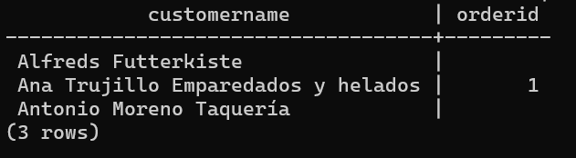

## Inner Join
-The INNER JOIN keyword selects records that have matching values in both tables.
-This is the syntax for Inner Join:
`SELECT column_name(s)
FROM table1
INNER JOIN table2
ON table1.column_name = table2.column_name;`
for exapmle we have this two tables, the product table and categories table,
We will join the Products table with the Categories table, by using the CategoryID field from both tables:
**SELECT ProductID, ProductName, CategoryName
FROM Products
INNER JOIN Categories ON Products.CategoryID = Categories.CategoryID;**

this is the final combined table.

## Left Join

The LEFT JOIN keyword returns all records from the left table (table1), and the matching records from the right table (table2). The result is 0 records from the right side, if there is no match.

example we create table customers and orders and use left join to join them.
we will use this code: **writer_side=# SELECT customers.customername, orders.orderid
writer_side-# FROM customers
writer_side-# LEFT JOIN orders ON customers.customersid = orders.customerid::INTEGER
writer_side-# ORDER BY customers.customername;**
and this is the final table

## Right Join

The RIGHT JOIN keyword returns all records from the right table (table2), and the matching records from the left table (table1). The result is 0 records from the left side, if there is no match.

here i will create another table for employee with the employeeID that i will right join with orders table.
**writer_side=# SELECT
writer_side-# employees.first_name,
writer_side-# employees.last_name
writer_side-# FROM orders
writer_side-# RIGHT JOIN employees
writer_side-# ON orders.employeeid::INTEGER = employees.employeeid::INTEGER
writer_side-# ORDER BY orders.orderid;**

## Full Join

The FULL OUTER JOIN keyword returns all records when there is a match in left (table1) or right (table2) table records.
here am going to use the customers table and the orders table to join the customersid with the ordersid

**writer_side=# SELECT
writer_side-#     Customers.CustomerName,
writer_side-#     Orders.OrderID
writer_side-# FROM Customers
writer_side-# FULL OUTER JOIN Orders
writer_side-# ON Customers.CustomersID::INTEGER = Orders.CustomerID::INTEGER
writer_side-# ORDER BY Customers.CustomerName;**

this is the output

## ACID Properties

### Atomicity
The term atomicity defines that the data remains atomic. It means if any operation is performed on the data, either it should be performed or executed completely or should not be executed at all. It further means that the operation should not break in between or execute partially. In the case of executing operations on the transaction, the operation should be completely executed and not partially.

### Concistency
The word consistency means that the value should remain preserved always. In DBMS, the integrity of the data should be maintained, which means if a change in the database is made, it should remain preserved always. In the case of transactions, the integrity of the data is very essential so that the database remains consistent before and after the transaction. The data should always be correct.

### Isolation
The term 'isolation' means separation. In DBMS, Isolation is the property of a database where no data should affect the other one and may occur concurrently. In short, the operation on one database should begin when the operation on the first database gets complete. It means if two operations are being performed on two different databases, they may not affect the value of one another. In the case of transactions, when two or more transactions occur simultaneously, the consistency should remain maintained. Any changes that occur in any particular transaction will not be seen by other transactions until the change is not committed in the memory.

### Durability
Durability ensures the permanency of something. In DBMS, the term durability ensures that the data after the successful execution of the operation becomes permanent in the database. The durability of the data should be so perfect that even if the system fails or leads to a crash, the database still survives. However, if gets lost, it becomes the responsibility of the recovery manager for ensuring the durability of the database. For committing the values, the COMMIT command must be used every time we make changes.

##NORMALIZATIONS

## First normal from

A relation is in the first normal form if the values that are in the domain of each attribute of relation are atomic. The first normal form forbids composite attributes, multi-valued attributes and any combinations. When it comes to an organized database, 1NF has two basic rules:

Remove identical columns from the same table.
Identify every row with a unique column or set of columns (primary key) and develop separate table for every group of related values.

## Second normal form

The table is said to be in second normal form when it fulfills all the requirements of the first normal form and there should not be any partial dependencies of any column on the primary key. It means that each non-primary key attribute is completely dependent on the primary key of that relation. If any of the columns depend on only one part of a concatenated key, then the table does not fall into 2NF. Second normal form is an intermediate step to higher normal forms and it is based on complete functional dependency.

## Third normal form

The table is said to be in the third normal form if it is in second normal form and :Nonprime attributes should be mutually independent.
Nonprime attributes should be functionally dependent on primary key.
The relation in third normal form consists of a group of independent non-prime attributes and a primary key. In 3NF, its necessary to remove transitive functional dependencies from the table.

## Boyce/ codd normal form
Proposed by R.F. Boyce, the BCNF is marginally stronger than the third normal form (3NF) and is known as the Boyce/Codd Normal form. Basically, it is an extension of the 3NF and is therefore termed as the 3.5NF. Though the BCNF and 3NF are generally compliant, they can be non-compliant in rare cases when the tables contain candidate keys that overlap each other. However, the BCNF deals with anomalies in a better way that 3NF generally fails to handle.

## Fourth normal form
The Fourth Normal Form (4NF) is a level of database normalization where there are no non-trivial multivalued dependencies other than a candidate key. It builds on the first three normal forms (1NF, 2NF, and 3NF) and the Boyce-Codd Normal Form (BCNF). It states that, in addition to a database meeting the requirements of BCNF, it must not contain more than one multivalued dependency.

